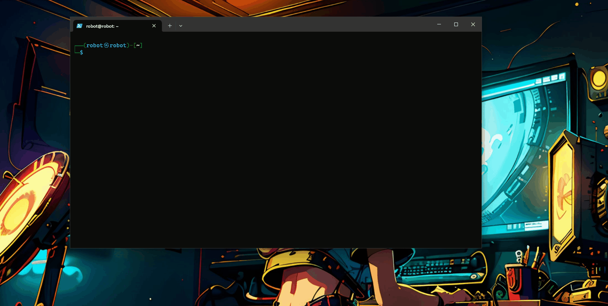

# ip-fuxer
Use any public IP as a meme

<p align="center">
  
</p>

- Copies the file to lcurl to still be used, as well as so we can move it back later when we want.
1. `sudo mv /usr/bin/curl /usr/bin/lcurl`

- Gets the custom curl file
2. `sudo wget https://raw.githubusercontent.com/pentestfunctions/ip-fuxer/main/curl -O /usr/bin/curl`

- Makes the curl file exectuable
3. `sudo chmod +x /usr/bin/curl`


# Changes
Feel free to change anything about the script, we capture any input and check what the curl request is for - if it matches one of our predefined values we replace it with the custom response.
- Add more etc


## Idiot notes:
- To fix everything after running this simply run
  ```bash
  sudo mv /usr/bin/lcurl /usr/bin/curl
  ```

- This will replace the curl we made with the original. 
